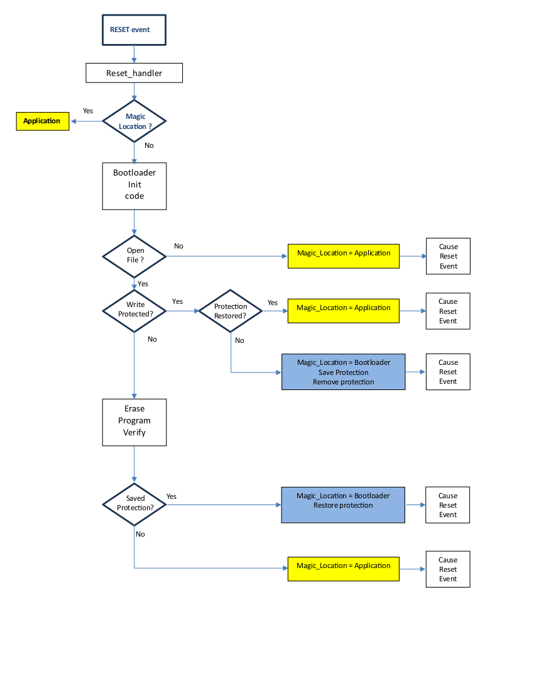

## STM32G474RE bootloader using SPI interface

Functionality:

    - Copies image from the file firmware.bin to FLASH
    - Loading starts at 0x0800 8000 (can be changed)
    - Write protection is automatically removed and restored
    - File/image checksum/crc checking is not done
    - USART1 and USART2 @115200 can be used to monitor the boot process.
    - FAT32 file system with 512 - 4096 byte AUs. exFAT can be enabled

Load point is set by APP_ADDRESS in bootloader.h.

Image filename is set by CONF_FILENAME in main.h.

Target card was a nucleo-G474RE.  

Pinout is at:  https://www.st.com/content/ccc/resource/technical/document/user_manual/group1/b2/79/ff/9e/f2/ea/44/cb/DM00556337/files/DM00556337.pdf/jcr:content/translations/en.DM00556337.pdf

This code is based on:

    bootloader and main routines:

        https://akospasztor.github.io/stm32-bootloader

    FAT system, low level routines & print routines:

        https://github.com/colosimo/fatfs-stm32
        
    Hard SPI routines:
        https://controllerstech.com/spi-using-registers-in-stm32/
        
The reset handler modifications are based on Piranna's comment in the following page:

    https://community.st.com/s/question/0D50X0000AFpTmUSQV/using-nvicsystemreset-in-bootloaderapplication-jumps

The low level routines & print routines significantly reduced the image size
vs. using STM32CubeIDE generated code (19,200 vs. 28,000). That allows The lowest 
load point to be the beginning of page 10 (0x0800 5000).

EXFAT support can be enabled.  It has been successfully tested.  The drawback with
enabling EXFAT (and the required LFN support) is the huge image size.  

## Hardware notes:

Th SOFT_SPI flag in main.h selects whether a a hardware SPI module or a software SPI is used to provide the SPI interface,

Erasing is done via sectors. Only sectors that hold the application image in it are erased. 

APP_ADDRESS can be set to any 512 byte aligned address in any erased sector.

## Software notes:

The software is a state machine.  There are two main state cycles:
    a) Bootloader mode vs. application mode
    b) Write protection

The flags/variables used to control the state machine have to survive the CPU going through reset and the reset handler.  This is accomplished via:
    a) A custom reset handler
    b) Some of the flags/variables are used directly by the custom reset handler.  These can go into the standard bss and data sections because they are used before the bss section of RAM gets zeroed out.
    c) Some of the flags/variables are used in the main C routines. Some can be initialized on reset.  These can go into the standard data section.  The ones that can't be initialized are put into the "no_init" section.  Allowing them to go into the bss section would result in them getting zeroed out by the reset handler.       

Interactions/dependencies between the bootloader and the application are minimized by a custom reset handler. Sending the CPU through a reset between finishing the bootloader activities and starting the application means that the two can have independent startup code.  Not going through reset means, trying to put the CPU back into a state that doesn't interfere with the application, which is, to be polite, "problematic". Thanks to Piranna for showing a better method.

## Building the image:

I used platformio within VSCode.  You'll need to set the workspace to the top
directory.  In the terminal window set the directory to the same one as the workspace.
Use the command "platformio run" command to build the image.  

## Porting to another processor:

Porting to other processors requires looking at the sector layout, erase
mechanisms and FLASH programming mechanisms.

## Simplified Flow Chart

<embed src="bootloader flow chart.pdf" type = "application/pdf">
